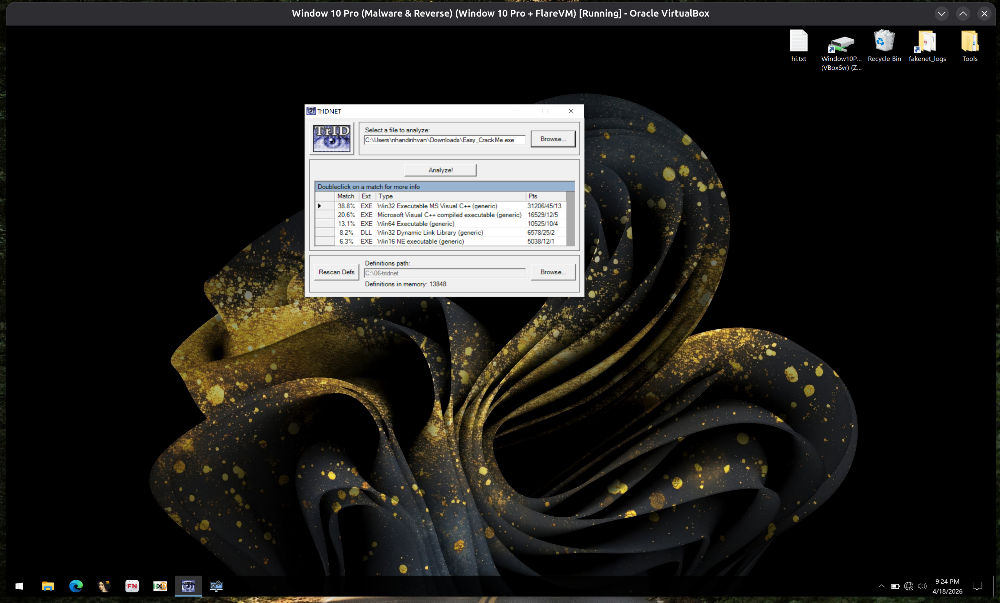
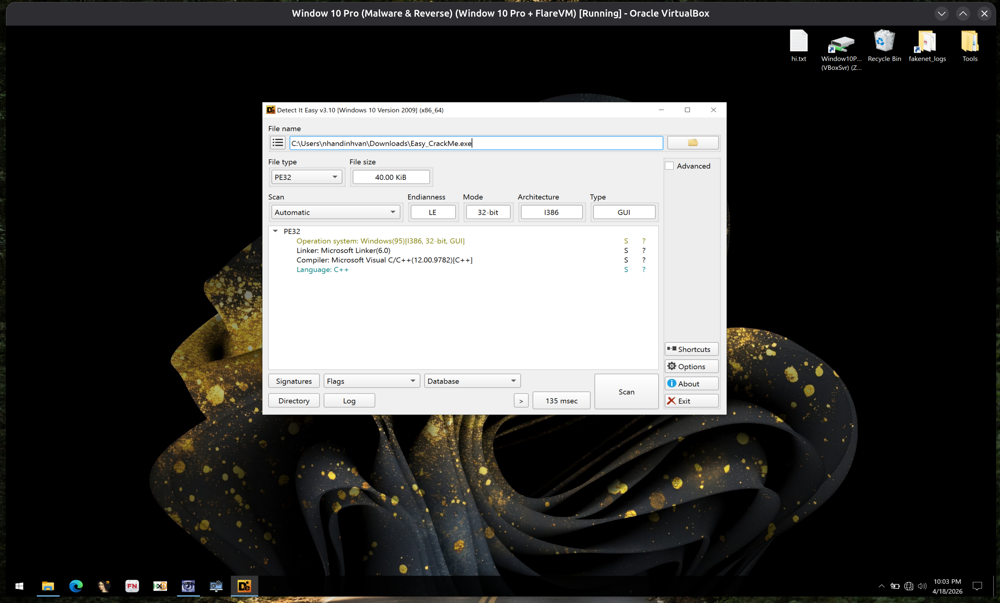
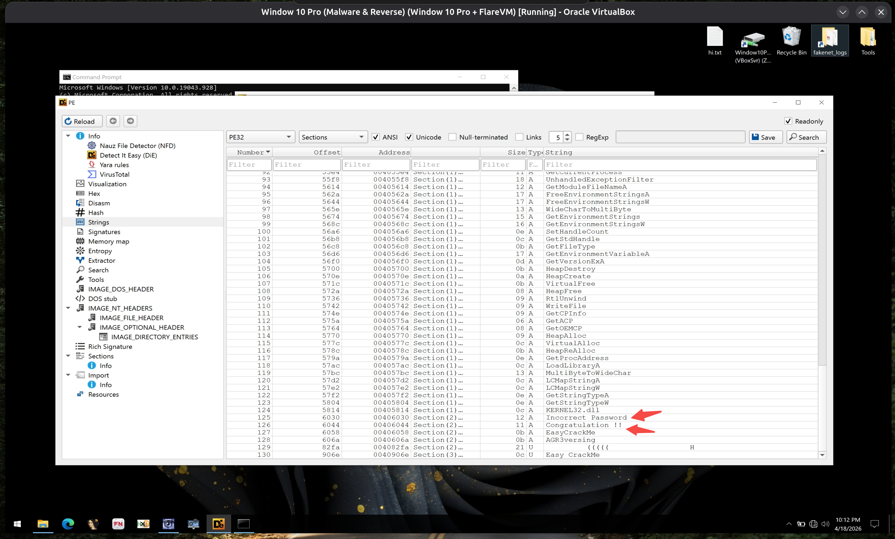
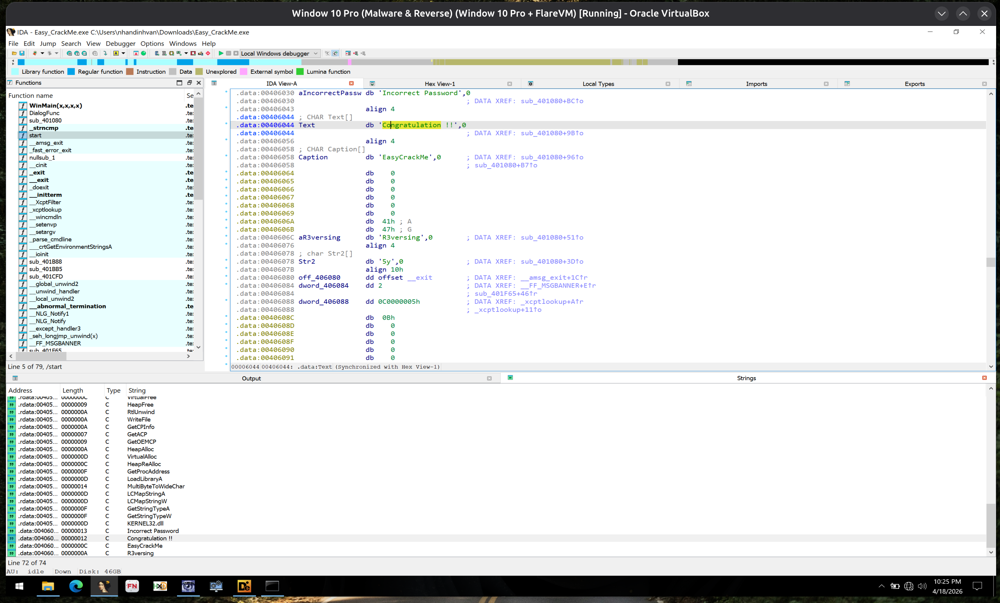
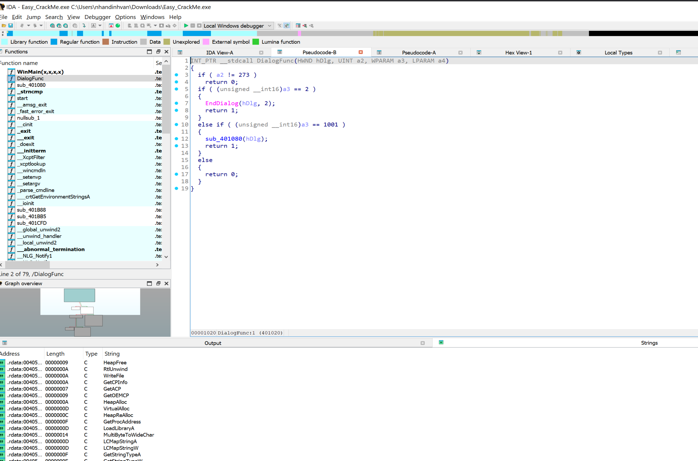
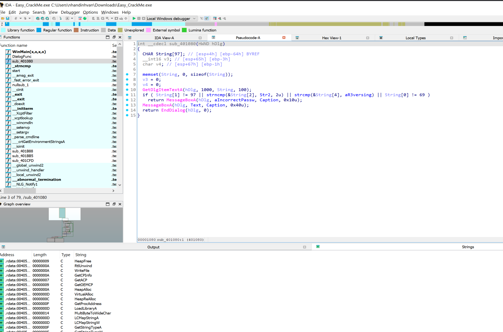
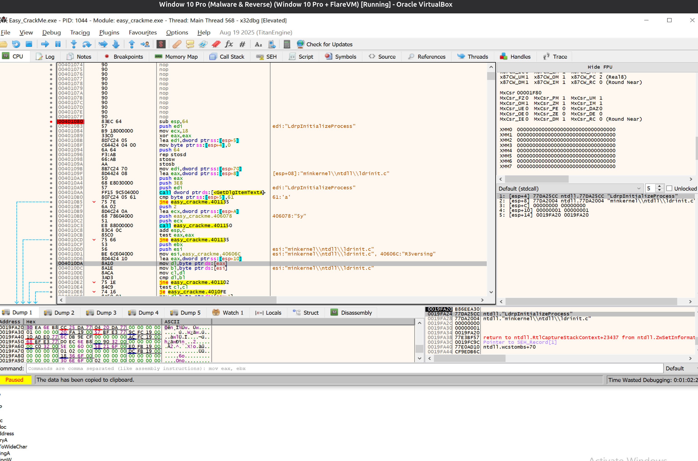
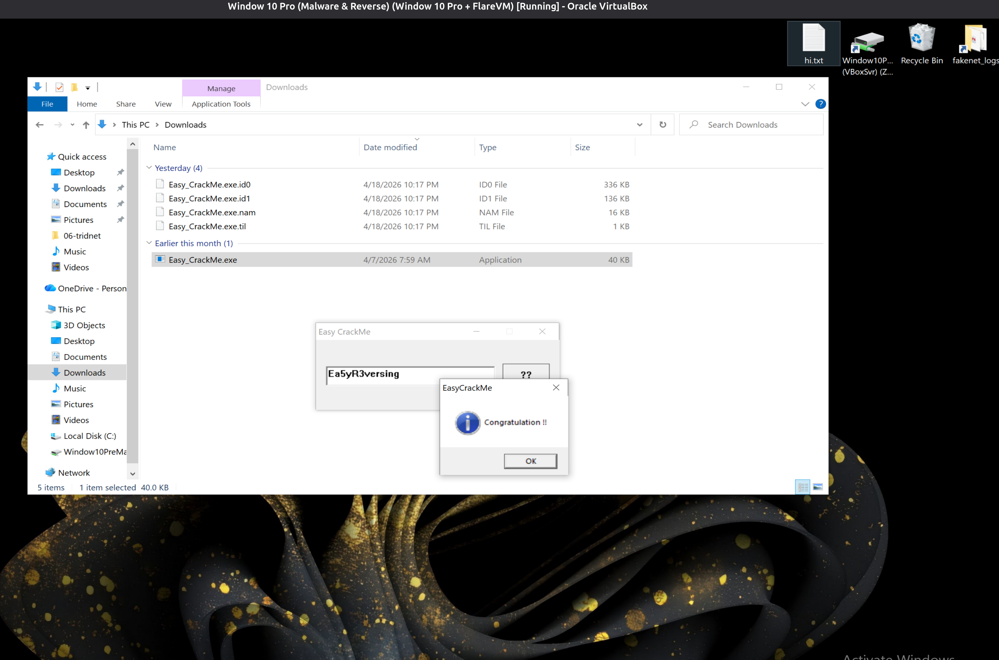

# Write-up - easy_crack 

## 1. Overview
- **Platform:** reverse.kr
- **Category:** Reverse Engineering
- **Difficulty:** Easy
- **Link:** (if available)

**Short Description:**
> A Windows crackme that presents a dialog box and validates a user-supplied password against a hardcoded value using manual character-by-character comparison (not using standard library functions). The goal is to reverse the validation logic and recover the correct password.

---

## 2. Initial Analysis

- **File type**  
  - Tools used: TrIDNET  
  - 32-bit Windows PE executable → suitable for x32dbg and IDA

<p align="center">
  
</p>
<p align="center"><em>Figure 1: Checking file type</em></p>

---

- **Packed?**  
  - Checked using Detect It Easy  
  - No packer detected → direct analysis possible

<p align="center">
  
</p>
<p align="center"><em>Figure 2: Checking if the file is packed</em></p>

---

- **Obfuscation?**  
  - Control flow is simple → no heavy obfuscation

<p align="center">
  
</p>
<p align="center"><em>Figure 3: Checking strings using DIE</em></p>

<p align="center">
  
</p>
<p align="center"><em>Figure 4: Checking strings using IDA</em></p>

---

- **Interesting strings**
```
"Congratulation!!"
"Incorrect Password"
"R3versing"
"5y"
```
---

## 3. Static Analysis

### Tools
- IDA Pro (32-bit)

### Structure Analysis

- Entry point: `start` → calls `WinMain`
- Main function: `WinMain` creates dialog via `DialogBoxParam`
- Important functions:
  - `DialogFunc` → handles user input
  - `sub_401080` → validation logic

### Key Data

| Address      | Value                |
| ------------ | -------------------- |
| `0x00406030` | "Incorrect Password" |
| `0x00406044` | "Congratulation !!"  |
| `0x0040606C` | "R3versing"          |
| `0x00406078` | "5y"                 |

### Notes

- Input is retrieved via `GetDlgItemTextA`
- No `strcmp` / `strncmp`
- Validation uses:
  - direct `cmp`
  - helper function
  - manual loop

<p align="center">
  
</p>
<p align="center"><em>Figure 5: DialogFunc overview</em></p>

<p align="center">
  
</p>
<p align="center"><em>Figure 6: sub_401080 validation logic</em></p>

---

## 4. Dynamic Analysis

### Tools
- x32dbg

### Breakpoints
- `sub_401080`
- comparison instructions (`cmp`, `jne`, ...)

### Strategy

Run the program, input dummy data, step through validation logic and observe comparisons in registers/memory.

<p align="center">
  
</p>
<p align="center"><em>Figure 7: Inspecting comparisons</em></p>

<p align="center">
  
</p>
<p align="center"><em>Figure 8: Successful execution path</em></p>

---

## 5. Reversing Logic

### Algorithm Analysis

The validation is split into multiple steps:

1. First character check
2. Substring `"a5y"`
3. Loop comparing `"R3versing"`

### Simplified Pseudocode

```c
int check_password(char *input) {
  if (input[0] != 'E') return 0;

  if (input[1] != 'a' || input[2] != '5' || input[3] != 'y')
    return 0;

  for (int i = 0; i < 9; i++) {
    if (input[4 + i] != "R3versing"[i])
      return 0;
  }

  return 1;
}
```

---

## 6. Solution

### Steps

1. Locate `sub_401080`
2. Identify character checks
3. Extract segments `"a5y"` and `"R3versing"`
4. Combine into final password

### Script

```python
part1 = "E"
part2 = "a5y"
part3 = "R3versing"

password = part1 + part2 + part3
print(password)
```

---

## 7. Result

* **Flag / Password:**

```
Ea5yR3versing
```

<p align="center">
  
</p>
<p align="center"><em>Figure 9: Correct password accepted</em></p>

---

## 8. Conclusion

* Manual comparison instead of library functions
* Password split into segments
* Important lesson: verify stack offsets carefully

---

## 9. References

* reversing.kr
* IDA Pro
* x64dbg
* Detect It Easy
* TrIDNET

```
```
